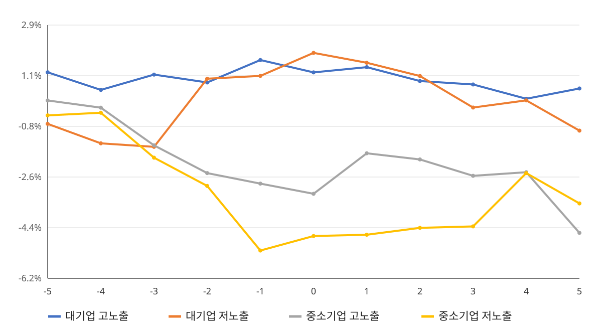
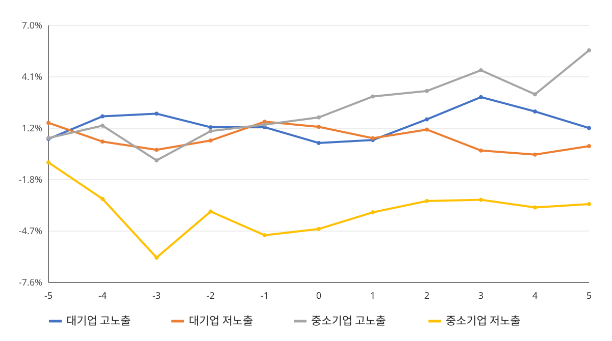

# **예고형 환경규제로 인한 기업 규모에 따른 주가의 상이한 변화**

**학번:** 2026195176

**성명:** 홍현수

**과정:** 연세대학교 AX Camp 연구 에이전트

## 초록

본 연구는 예고형 환경 관련 제도의 첫 논의 및 발표가 국내 상장기업의 단기 주가에 어떻게 반영되었는지를 기업의 규모에 따라 비교한다. 분석 대상 사건은 2010년 11월 17일 온실가스 배출권거래제 법률 제정안(K-ETS) 입법예고와 2021년 1월 14일 ESG 정보공개 및 지속가능경영보고서 공시의 단계적 의무화 일정 발표이다. 각 사건을 중심으로 사건일 전후 5거래일, 즉 [-5, +5]의 주가 자료를 구축하고, 사건 당시 상장 여부와 가격 자료의 연속성을 확인한 기업만 분석에 포함하였다. 실제 주가 움직임은 사건기간 최초 거래일의 가격을 기준으로 산출하였고, 사건이 없었을 때의 비교경로는 개별 기업이 속한 KOSPI 또는 KOSDAQ 지수 수익률을 기대수익률로 사용하는 시장조정모형으로 계산하였다. 비정상수익률은 실제수익률에서 시장수익률을 차감하여 구하고, 이를 누적해 누적비정상수익률(CAAR)을 산출하였다.

확인된 표본은 ESG 사건 33개사, K-ETS 사건 26개사이다. 핵심 비교는 대기업·고노출, 대기업·저노출, 중소기업·고노출, 중소기업·저노출의 네 집단이다. t=+5의 각 집단의 실제 누적수익률은 K-ETS에서 -0.56%, -2.97%, -7.61%, -7.64%였으며, ESG 규제에서는 +7.71%, +6.57%, +7.55%, -3.32%였다. 또한 같은 시점의 각 집단의 CAAR은 K-ETS에서 +0.59%, -0.92%, -4.60%, -3.54%였고, ESG 규제에서는 +1.18%, +0.16%, +5.61%, -3.15%였다.

**주요어:** 환경규제, 기업 규모, 주가 반응, 이벤트 스터디, 비정상수익률, K-ETS, ESG 공시

 

## 1. 서론

환경정책은 기업의 생산방식과 공시의무, 비용구조에 변화를 요구한다. 그러나 정책의 경제적 효과가 실제 제도 시행 시점에만 나타나는 것은 아니다. 법률안이나 의무화 일정이 사전에 공개되면 시장참여자는 공개된 정보를 토대로 기업의 미래 현금흐름과 위험을 다시 평가할 수 있다. 따라서 정책의 시행 이전이라도 발표일 주변의 주가에는 새로운 정보가 반영될 수 있다. 이러한 특성 때문에 본 연구는 정책이 실제로 적용되기 시작한, 다시 말해 법이 국회를 통과한 순간이 아니라 정책이 처음으로 논의되기 시작한 순간을 중심으로 주가 변동의 방향성을 관찰하고 분석한다. 정책이 실제로 적용되기 시작한 순간에는 환경 규제 이벤트가 주가에 선반영되어 있어서 주가 변동이 뚜렷하게 나타나지 않을 가능성이 높기 때문이다.

기존 환경규제 연구는 규제 대상기업 전체의 평균적인 성과 변화를 분석하거나, 특정 산업과 제도의 장기 효과를 검토하는 경우가 많았다. 하지만 동일한 정책 정보가 공개되더라도 모든 기업의 주가가 동일하게 움직인다고 보기 어렵다. 대기업과 중소기업은 자금조달 여건, 시장 내 정보량, 사업 포트폴리오와 규제 대응에 활용할 수 있는 자원의 규모가 다르다. 또한 동일한 규모 집단 안에서도 배출집약 산업과 정보·서비스 산업처럼 환경정책에 대한 노출 정도가 다를 수 있다. 그러므로 전체 평균만 제시하면 사건일 주변에서 나타난 집단별 움직임을 충분히 보여주지 못할 가능성이 있다.

본 연구는 이러한 문제의식에서 출발해 두 환경 관련 정책 발표를 대상으로 단기 주가경로를 정리한다. 첫 번째 사건은 2010년 11월 17일 온실가스 배출권거래제 법률 제정안 입법예고이고, 두 번째 사건은 2021년 1월 14일 ESG 정보공개와 지속가능경영보고서의 단계적 의무화 일정 발표이다. 두 사건은 제도의 실제 시행보다 앞서 향후의 규제 또는 공시 방향을 시장에 제시했다는 공통점을 갖는다. 동시에 배출권거래제는 배출량과 비용에 직접 연결되는 제도인 반면, ESG 공시는 정보공개의 범위와 방식에 관한 제도라는 점에서 내용이 다르다. 본 연구는 사건별 결과를 각각 산출하고, 일반화할 수 있는 가능성이 있는지를 따져본다.

분석의 중심은 기업 규모와 환경 규제 노출도를 결합한 네 집단의 비교이다. 구체적으로 대기업·고노출, 대기업·저노출, 중소기업·고노출, 중소기업·저노출의 실제 주가경로와 사건 부재 기대경로를 각각 산출한다. 대기업과 중소기업의 단순 비교는 네 집단 결과를 규모 기준으로 다시 합친 보조 집계로 제시한다. 이러한 구성은 환경 규제 노출도 차이만 볼 때 가려질 수 있는 유사한 규제 노출도 업종의 기업 규모에 따른 상이한 결과를 함께 반영하기 위한 것이다.

논문의 구성은 다음과 같다. 제2절은 두 정책 사건의 제도적 배경을 설명한다. 제3절은 본 연구와 깊은 연관성을 갖고 있는 선행 연구들을 정리한다. 제4절은 표본 구성, 사건기간, 실제 주가경로와 시장조정 비정상수익률의 계산 방법을 제시한다. 제5절은 실제 주가와 사건 부재 기대경로의 계산 결과를 객관적으로 기술한다. 제 6절에서는 계산 결과의 해석, 일반화 가능성, 그리고 결론 및 정책적 시사점을 제시한다.

## 2. 제도적 배경

### 2.1 온실가스 배출권거래제 법률 제정안 입법예고

배출권거래제는 정부가 일정 기간의 온실가스 배출총량을 정하고, 규제 대상에게 배출권을 할당한 뒤 그 권리를 거래할 수 있게 하는 제도이다. 기업이 할당량보다 적게 배출하면 남은 배출권을 보유하거나 거래할 수 있고, 할당량보다 많이 배출하면 부족분을 확보해야 한다. 이 구조에서 제도 도입에 관한 구체적인 법률안의 공개는 배출량이 많은 기업과 에너지 사용 비중이 높은 기업의 향후 비용 및 의무에 관한 정보를 시장에 제공한다.

국무총리실은 2010년 11월 17일 「온실가스 배출권 거래제도에 관한 법률」 제정안을 입법예고하였다. 이 날짜는 배출권거래제의 세부적인 제도 설계가 법률안 형태로 공개된 시점이라는 점에서 본 연구의 사건일로 사용된다. 이후 제정안은 산업계 의견 등을 반영해 수정되었고, 관련 법률은 2012년 제정되어 2015년부터 시행되었다. 따라서 본 연구의 2010년 사건은 제도의 실제 시행 효과를 측정하는 사건이 아니라, 향후 제도 도입에 관한 구체적인 정보가 공개된 시점의 단기 주가 움직임을 관찰하는 사건이다.

K-ETS 사건 표본을 구성할 때에는 2010년 당시의 상장 여부를 기준으로 기업을 선별하였다. 현재 존재하는 기업명이나 종목코드를 과거 자료에 기계적으로 연결하지 않았으며, 사건일 이후 상장한 기업과 법인 동일성을 확인하기 어려운 기업은 제외하였다. 이러한 절차를 거쳐 26개사가 분석에 포함되었다. 기업의 규모 구분은 시가총액 상위 20%는 대기업, 하위 20%는 중소기업으로 구분하였고, 노출도는 발전·전력, 철강·비철, 시멘트, 정유, 석유화학, 반도체·디스플레이 등 정책과의 관련성이 높은 업종을 고노출로, 그 외의 업종들은 저노출로 분류하였다.

### 2.2 ESG 정보공개 및 지속가능경영보고서 단계적 의무화 일정 발표

금융위원회는 2021년 1월 14일 기업공시제도 개선방안을 통해 지속가능경영보고서 공시의 단계적 의무화 일정을 발표하였다. 발표 당시 일정은 2025년까지 자율공시를 활성화하고, 2025년부터 2030년 사이 일정 규모 이상의 코스피 상장사에 공시를 의무화한 뒤, 2030년부터 전체 코스피 상장사로 의무대상을 확대하는 구조였다. 이는 공시의무가 즉시 모든 기업에 동일하게 적용되는 방식이 아니라 기업 규모와 시점에 따라 단계적으로 확대되는 계획이었다.

ESG 공시는 환경·사회·지배구조에 관한 비재무정보를 일정한 형식으로 시장에 제공하는 제도이다. 배출권거래제처럼 배출량에 따라 직접적인 배출권 제출의무를 부과하는 제도는 아니지만, 기업이 관리하고 공개해야 하는 정보의 범위를 확대한다. 또한 투자자가 기업 간 ESG 정보를 비교할 수 있는 기반을 제공한다. 본 연구에서는 공시제도의 장기적인 경영성과 효과가 아니라, 의무화 일정이 공개된 2021년 1월 14일 주변의 주가 변동만 분석한다.

ESG 사건 표본은 사건일 당시 상장되어 있고 사건기간 가격자료가 확인되는 기업으로 구성하였다. 원래의 후보군에서 한화솔루션은 사건기간 중 유상증자와 관련된 기업 고유 사건 및 수정주가 조정계수 변화가 확인되어 분석에서 제외하였다. 최종 표본은 33개사이다. 네 개의 세부집단을 구성할 때에는 대기업·고노출, 대기업·저노출, 중소기업·고노출, 중소기업·저노출로 구분하였으며, 고노출 업종에는 철강·비철, 정유·석유화학, 발전, 시멘트, 반도체·디스플레이, 자동차 등 ESG 정보공개 항목과 환경자료의 중요성이 상대적으로 큰 업종을 포함하였다.

## 3. 선행연구와 분석 범위

### 3.1 K-ETS 이중차분법 선행 연구

한 선행연구에서는 K-ETS 사건 하나만을 중심으로 예고형 환경 규제의 중장기적 효과를 분석하였다. Hyejin(2024)이 인용한 일부 선행 연구들은 환경 규제가 기업에 긍정적인 영향을 주는지 아닌지에 대한 비일관적인 분석 결과를 제시했다. 이러한 비일관성과 더불어, Hyejin(2024)은 한국 같은 신흥 시장은 관련 연구가 부족하다는 사실을 확인하였고, 이 두 가지 궁금증 및 미해결점을 해결하고자 연구를 착수하였다. 이때, Hyejin(2024)의 연구는 K-ETS를 소재로 하였다는 점에서 본 연구와 비슷하지만, 이 선행 연구는 오로지 K-ETS를 중심으로 연구를 진행했고 일반화를 시도하지 않았다는 점에서 본 연구와 차이가 있다. 아울러, K-ETS라는 환경 규제로 인한 기업의 주가 반응 및 효과를 오로지 기업의 환경 노출도만을 변수로 두어 분석하였고, 대기업과 중소기업 간의 이질적인 반응성에 대해서는 전혀 연구하지 않았다. 기업의 규모는 통제 변인으로 두어 연구를 진행하였기 때문이다. 마지막으로, 이 선행연구는 중장기적인 주가 변동성을 관찰하기 위해 이중차분법(DiD)을 사용하였고, 이는 단기적인 주가 변동성을 확인하기 위해 이벤트 스터디 방법론을 적용하는 본 연구와 결정적인 차이를 갖는다고 말할 수 있다.

### 3.2 해외 선행 연구 사례

해외 선행 연구도 여럿 존재하지만, 본 연구의 초점과는 여전히 크게 다른 점이 존재한다. 먼저, 싱가포르를 중심으로 한 연구에서는 이벤트 스터디 이론을 중심으로 싱가포르에서 발생한 여러 가지의 환경 규제로 인한 기업들의 단기 주가 반응성을 분석하였다(Pham 2019). 이 논문은 나름대로 일반화를 하려고 시도한 흔적이 보이며, 이벤트 스터디 방법론을 사용했다는 점에서 본 연구와 비슷하게 연구를 진행한 감이 있다. 그러나, 이 선행 연구 역시 기업의 규모는 통제 변인으로 두고, 오로지 기업의 환경 노출도를 독립 변수로 보아 연구를 진행하였다. 이 부분이 본 연구와 가장 뚜렷하게 차이 나는 부분이라고 할 수 있다. 아울러, 이 선행연구는 싱가포르를 사례로 두어 연구를 진행했기 때문에, 한국의 사례인 K-ETS와 ESG 공시 의무와는 차이가 나는 결과가 도출될 수 있다. 그러나, 이 부분은 본 연구와의 뚜렷한 차이점이라고 보기 어렵다. 한국을 사례로 연구한 선행 연구들이, 다시 말해 Hyejin(2024)와 같은 논문들이 존재하기 때문이다.

미국을 중심으로 한 연구도 마찬가지이다. 이 논문(Wang 2023)도 미국을 중심으로 연구를 진행했기 때문에 우리나라의 실정과는 차이가 날 수는 있지만, 이 역시 본 연구와 뚜렷한 차이로 볼 수는 없다. 또한, 이 논문은 ESG 공시 의무 규제에 따른 주가 반응을 본다는 점에서 본 연구와 겹치는 부분이 있다고 할 수 있다. 하지만, 이 논문은 단일 이벤트만을 보았다는 점에서, 다시 말해 일반화를 전혀 시도하지 않았다는 점에서 본 연구와 차이가 있다. 아울러, Wang(2023)의 선행 연구도 앞서 언급한 다른 선행 연구들과 마찬가지로 기업의 주가 변동성을 관찰할 때 환경 노출도가 높은 기업과 낮은 기업만을 초점을 두어 연구했다. 다시 말해 이 선행 연구도 본 연구와 다르게 기업의 규모를 통제 변인으로 두어 연구를 진행하였다고 말할 수 있다.

### 3.3 규제는 기업에게 이득인가 손실인가에 관한 선행 연구

규제가 기업에게 이득인지 손실인지도 불분명하다. 이러한 불분명은 Hyejin(2024)의 논문에서도 언급된 바가 있다. 또한, 이러한 불명확성을 드러내는 대표적인 두 논문이 있는데, Porter(1995)가 진행한 연구와 Telle(2007)가 진행한 연구가 바로 그것이다. Porter(1995)에서 포터는 포터 가설을 내세우며 적절한 환경규제는 기술혁신을 유발하므로 규제 준수비용을 상쇄한다고 주장하였다. 다시 말해, 환경 규제는 기업에게 이득이 될 수 있다는 것을 이 선행 연구에서 보여주었다. 반면, Telle(2007)에서는 환경 규제가 기업의 생산성 증가를 저해한다는 결론을 내렸다. 이는 기업에게 환경 규제가 손실이 될 수 있다는 것을 보여주었다. 이러한 상충되는 연구들을 계기로 본 연구가 시작되었다고 해도 무방할 정도로, 둘의 상반된 연구는 수많은 후속 연구들을 낳았다.

### 3.4 본 연구의 범위

본 연구는 기업의 규모를 통제 변인이 아닌 독립 변수로 두고, 앞선 선행 연구들이 집중하였던 두 사례: 온실가스 배출권거래제와 ESG 공시 의무 규제를 중심으로 단기적인 주가의 변동을 집중적으로 다룬다. 재무제표를 이용한 중장기 수익성 분석, 이중차분 및 장기 베타 고려하지 않고, 오로지 단기 수익성만을 바탕으로 주가의 변동성을 확인하고자 한다.

## 4. 자료와 연구방법

### 4.1 사건일과 사건기간

분석 사건은 K-ETS 법률 제정안 입법예고와 ESG 공시 의무화 일정 발표이다. K-ETS 사건일은 2010년 11월 17일, ESG 사건일은 2021년 1월 14일이다. 두 날짜 모두 한국 주식시장의 거래일이며 해당 거래일을 t=0으로 둔다. 사건기간은 t=-5부터 t=+5까지의 11거래일이다. 수익률 계산에는 t=-5 직전 거래일 가격이 추가로 필요하므로 내부 계산에서는 t=-6의 가격을 사용하되, 분석표와 그래프에는 t=-5부터 t=+5까지만 표시한다.

짧은 사건기간을 선택한 이유는 발표일 주변의 움직임을 관찰 대상에 맞추기 위해서이다. 사건기간을 길게 설정하면 정책 발표와 무관한 실적발표, 자금조달, 합병, 산업 뉴스와 거시경제 변화가 함께 들어올 가능성이 커진다. 따라서 본 연구의 결과는 발표 전후 11거래일 안에서 관찰된 수익률로 한정된다.

### 4.2 표본과 자료 정제

기업 후보는 규모와 규제 노출도를 기준으로 만든 2×2 기업분류표에서 출발하였다. 각 사건일을 기준으로 상장 여부, 당시의 종목코드와 회사명, 가격자료의 존재 여부를 확인하였다. 사건일 이후 상장된 기업, 과거 법인과 현재 법인의 연속성이 불명확한 기업, 사건기간 중 필요한 가격을 확보할 수 없는 기업은 분석에서 제외하였다. ESG 사건에서는 한화솔루션을 기업 고유 사건과 수정주가 조정 문제로 제외하였다. 정제 후 표본은 ESG 33개사, K-ETS 26개사이다. 기업의 규모와 노출도를 기준으로 만든 2×2 기업분류표는 아래와 같다. 굵은 글씨는 K-ETS 첫 논의 때에도, 그리고 ESG 공시 의무 규제 첫 논의 때에도 일관되게 대기업 혹은 중소기업이었던 기업들을 의미한다.

|  | 고노출 | 저노출 |
| --- | --- | --- |
| 대기업 | **한국전력**, 한국가스공사 **POSCO 홀딩스** 한일 시멘트, 쌍용 C&E SK 이노베이션 **LG 화학 삼성전자, SK 하이닉스 현대자동차, 현대모비스** 한화솔루션 | **Naver** Kakao KB금융 SK 텔레콤 신한지주 |
| 중소기업 | 지엔씨에너지, 에스에너지 **화인베스틸 고려시멘트**, 삼표시멘트 **극동유화, 미창석유공업** 케이피엠테크, 와이엠티 마이크로컨텍솔, 아이컴포넌트 **대동금속, 새론오토모티브** | 핑거 갤럭시아머니트리 SGA 브릿지바이오테라퓨틱스 인크로스 |
|  |  |  |
| 고노출 | 발전·전력, 철강·비철, 시멘트, 정유, 석유화학, 반도체·디스플레이, 자동차 |  |

표1. ESG 공시 의무 규제를 기준으로 한 2×2 기업분류표

|  | 고노출 | 저노출 |
| --- | --- | --- |
| 대기업 | (한화 솔루션 제외 사실상 위와 동일) | **삼성화재** 기업은행 엔씨소프트 삼성SDS CJ ENM |
| 중소기업 | (사실상 위와 동일) | 비트컴퓨터 다날 이스트소프트 |
|  |  |  |
| 고노출 | 발전·전력, 철강·비철, 시멘트, 정유, 석유화학, 반도체·디스플레이 |  |

표2. K-ETS를 기준으로 한 2×2 기업분류표

원자료는 기업별 시가, 고가, 저가, 종가, 수정종가, 거래량과 시장지수 자료를 포함하도록 수집되었다. 수익률은 수정종가가 확인되는 경우 수정종가를 사용하고, 그렇지 않은 경우 일반 종가 수익률을 별도로 구분하도록 설계하였다. 동일 기업·동일 날짜의 특별 이벤트(전쟁, 실적 발표 등), 0 이하의 가격, 음수 거래량, 사건일 누락 여부와 11거래일 구성 여부를 점검하였다. 모든 기업의 실제 주가 움직임을 정리할 때에는 종가와 수익률뿐 아니라 사건기간의 고점·저점과 최대 일간 상승·하락도 확인하였다.

### 4.3 실제 주가경로

기업 간 주가 수준이 크게 다르므로 원화 단위 종가를 직접 평균하지 않고, 사건기간의 시작점을 공통 기준으로 바꾸어 비교한다. 만약 그런 과정을 거치지 않는 경우 시작일 주가가 더 큰 기업이 평균을 계산할 때 더 큰 영향을 줄 수 있기 때문이다. 기업 i의 기준시점 대비 정규화 가격지수는 다음과 같이 계산한다.

$$
Normalized Price_{i,t}=100×\frac{P_{i, t}}{P_{i, -6}}
$$

정규화 주가 지수 = $100×\frac{현재 주가}{시작일 주가}$

여기서 P는 수정종가 또는 자료에서 사용 가능한 비교 가능한 종가이다. 기준일의 값을 100으로 두면 서로 다른 가격수준을 가진 기업을 같은 축에서 비교할 수 있다. 또한 시작일 t=-5기간의 수익률을 계산하기 위해 t=-6을 시작일 주가로 잡았다. 사건기간 전체의 실제 보유기간 수익률은 시작가격과 종료가격의 비율로 계산한다. 집단 평균은 개별 기업 수익률의 단순평균으로 산출하였다. 기업별 시가총액 가중치를 적용하지 않았으므로 각 기업은 집단 평균에서 동일한 비중을 가진다.

### 4.4 시장조정 이벤트 스터디

개별 기업의 일별 실제수익률은 전 거래일 대비 가격변화율로 계산한다.

$$
R_{i,t}=\frac{P_{i,t}}{P_{i,t-1}}-1 \\
실제 누적 수익률= \frac{마지막 날 주가}{시작일 주가}-1
$$

기대수익률은 해당 기업이 상장된 시장의 지수수익률을 사용한다. KOSPI 상장기업에는 KOSPI, KOSDAQ 상장기업에는 KOSDAQ의 같은 거래일 수익률을 대응시켰다.

$$
E(R_{i,t})=R_{m,t}
$$

일별 비정상수익률(시장의 일반적인 움직임을 넘어선 추가적인 수익률)은 실제수익률에서 시장수익률을 차감하여 계산한다.

$$
AR_{i,t}=R_{i,t}-R_{m,t}
$$

기업별 누적비정상수익률(CAAR)은 사건기간 시작일부터 해당 거래일까지의 비정상수익률을 더한 값이다.

$$
CAR_{i,[-5,t]}=\sum_{τ=-5}^{t}AR_{i,τ}
$$

집단별 평균 비정상수익률과 누적평균 비정상수익률은 각 집단에 포함된 기업의 AR(비정상수익률)과 CAAR을 산술평균하여 구한다. 또한 실제 가격경로와 시장지수에 따라 움직였다고 가정한 기대 가격경로를 별도로 계산해 두 경로를 같은 그래프에 표시하였다. 이때 본문에서 제시하는 실제수익률, 기대수익률과 실제-기대 차이는 동일한 시작점을 기준으로 한 사건기간 누적 변화이다.

## 5. 실증결과

### 5.1 K-ETS 사건의 네 집단 결과

K-ETS 사건의 분석 표본 26개사는 대기업·고노출 10개사, 대기업·저노출 4개사, 중소기업·고노출 9개사, 중소기업·저노출 3개사로 구성되었다. 대기업·고노출 집단의 실제 평균지수는 t=-5의 102.22에서 t=0의 98.50, t=+5의 99.44로 움직였다. t=+5의 기대지수는 98.90이었으며, 실제 누적수익률은 -0.56%, 기대 누적수익률은 -1.10%였다. 시장 대비 누적 차이는 CAAR +0.59%로 계산되었다.

대기업·저노출 집단의 실제 평균지수는 t=-5의 100.17에서 t=0의 98.76, t=+5의 97.03으로 움직였다. t=+5의 기대지수는 98.15였고, 실제 누적수익률은 -2.97%, 기대 누적수익률은 -1.85%였다. CAAR는 -0.92%였다.

중소기업·고노출 집단의 실제 평균지수는 t=-5의 100.68에서 t=0의 93.42, t=+5의 92.39로 움직였다. t=+5 기대지수는 96.90이었으며, 실제 누적수익률은 -7.61%, 기대 누적수익률은 -3.10%였다. CAAR는 -4.60%였다. 중소기업·저노출 집단의 실제 평균지수는 t=-5의 99.88에서 t=0의 91.48, t=+5의 92.36으로 움직였다. 기대지수는 95.90이었고, 실제 누적수익률 -7.64%, 기대 누적수익률 -4.10%, CAAR -3.54%를 기록하였다.

**표 3. K-ETS 사건의 네 집단별 t=+5 결과**

| **집단** | **n** | **실제 누적수익률** | **기대 누적수익률** | **CAAR** |
| --- | --- | --- | --- | --- |
| 대기업·고노출 | 10 | -0.56% | -1.10% | +0.59% |
| 대기업·저노출 | 4 | -2.97% | -1.85% | -0.92% |
| 중소기업·고노출 | 9 | -7.61% | -3.10% | -4.60% |
| 중소기업·저노출 | 3 | -7.64% | -4.10% | -3.54% |

더 자세한 결과는 아래의 그래프를 통해 확인할 수 있다.

그래프 1. K-ETS 네 집단 CAAR

K-ETS 관련 모든 그래프를 삽입하면 그래프의 양만 많아지고 논문의 길이만 길어질 것을 감안하여 대표주자인 CAAR 그래프만을 여기에다가 삽입하였고, 그 외의 내용들은 글로 리포트만 하였다.

그래프 1을 통해서 보면 알 수 있듯이, K-ETS가 처음으로 논의되기 시작한 t=0일 때, 중소기업 고노출과 대기업 고노출은 CAAR이 뚜렷하게 증가하는 양상을 보인다는 것을 확인할 수 있고, 반대로 대기업 저노출과 중소기업 저노출은 뚜렷하게 감소하거나 CAAR이 거의 일정한 양상을 보여주었다. 이러한 양상은 정규화 주가 지수의 실제, 기대 그래프에서도 확인되었다. 대기업 고노출과 중소기업 고노출은 t=0일 때, 실제 평균지수가 기대 평균지수보다 가파르게 증가하는 모습을 보인 반면, 대기업 저노출과 중소기업 저노출은 기대 평균지수보다 실제 평균지수가 완만하게 증가하는 모습을 보였다. 모든 네 집단에서 기대 수익률이 t=0일 때 증가하는 양상을 띄었다는 것을 감안한다면 실제 수익률의 증가 양상 차이는 의미 있다고 할 수 있다.

한편, CAAR 그래프는 전반적으로 대기업이 위쪽에서 군림하고 있다는 것을 확인할 수 있고, 반면 중소기업은 아래쪽에서 군림하고 있다는 것을 확인할 수 있다. 이는 뒤에서 언급할 기업 규모만을 바탕으로 한 보조 집계를 바탕으로 했을 때 조금 더 자세하게 드러난다. 아울러, CAAR를 포함한 여러 그래프들을 참고했을 때 t=5로 갈수록 대기업 저노출, 중소기업 고노출, 중소기업 저노출은 지표가 하락세라는 것을 확인할 수 있다.

### 5.2 ESG 공시 사건의 네 집단 결과

ESG 사건의 분석 표본 33개사는 대기업·고노출 11개사, 대기업·저노출 5개사, 중소기업·고노출 13개사, 중소기업·저노출 4개사로 구성되었다. 대기업·고노출 집단의 실제 평균지수는 t=-5의 102.70에서 t=0의 106.25, t=+5의 107.71로 움직였다. t=+5 기대지수는 106.49였으며, 실제 누적수익률은 +7.71%, 기대 누적수익률은 +6.49%였다. CAAR는 +1.18%였다.

대기업·저노출 집단의 실제 평균지수는 t=-5의 103.62에서 t=0의 107.34, t=+5의 106.57로 움직였다. t=+5 기대지수는 106.49였고, 실제 누적수익률은 +6.57%, 기대 누적수익률은 +6.49%였다. CAAR는 +0.16%였다.

중소기업·고노출 집단의 실제 평균지수는 t=-5의 101.80에서 t=0의 104.08, t=+5의 107.55로 움직였다. t=+5 기대지수는 102.00이었으며, 실제 누적수익률은 +7.55%, 기대 누적수익률은 +2.00%였다. CAAR는 +5.61%였다. 중소기업·저노출 집단의 실제 평균지수는 t=-5의 99.99에서 t=0의 95.35, t=+5의 96.68로 움직였다. 기대지수는 100.00이었고, 실제 누적수익률 -3.32%, 기대 누적수익률 +0.00%, CAAR -3.15%를 기록하였다.

**표 4. ESG 공시 사건의 네 집단별 t=+5 결과**

| **집단** | **n** | **실제 누적수익률** | **기대 누적수익률** | **CAAR** |
| --- | --- | --- | --- | --- |
| 대기업·고노출 | 11 | +7.71% | +6.49% | +1.18% |
| 대기업·저노출 | 5 | +6.57% | +6.49% | +0.16% |
| 중소기업·고노출 | 13 | +7.55% | +2.00% | +5.61% |
| 중소기업·저노출 | 4 | -3.32% | +0.00% | -3.15% |

더 자세한 결과는 아래 그래프를 통해 더 자세하게 파악할 수 있다.

그래프 2. ESG 공시 의무 네 집단 CAAR

여기도 마찬가지로ESG 공시 의무 규제 관련 모든 그래프를 삽입하면 그래프의 양만 많아지고 논문의 길이만 길어질 것을 감안하여 대표주자인 CAAR 그래프만을 여기에다가 삽입하였고, 그 외의 내용들은 글로 리포트만 하였다.

그래프 2를 통해서 확인할 수 있듯이, 중소기업 저노출의 CAAR은 음의 영역에서만 놀고 있다. 반면 그래프 1에서 보여준 양상과 다르게 중소기업 고노출의 CAAR은 전반적으로 증가하는 양상을 보여주었다. 아울러 대기업 고노출과 중소기업 고노출의 CAAR은 t=0일 때 전반적으로 상승하는 경향성을 보였고, 이는 중소기업 저노출에서도 마찬가지였다. 반면, 대기업 저노출은 t=0일 때 CAAR이 하락하는 양상을 띄었다. 그 외에 추가적으로 여기에 없는 그래프의 내용을 분석하자면, 정규화 주가 지수의 기대 및 실제 양상을 비교해보았을 때, 대기업 고노출과 중소기업 고노출은 기대 지수 하락 정도보다 완만하게 지수가 하락하였고, 반면 대기업 저노출과 중소기업 저노출은 기대 지수 하락 정도보다 가파르게 하락했다는 것을 확인할 수 있었다.

한편 CAAR을 포함한 그래프를 확인해 보았을 때, 중소기업 고노출을 제외한 다른 그룹들은 K-ETS 사례와 비슷한 양상으로 움직였으며, 중소기업 고노출 기업만이 K-ETS 사례와는 다르게 실제 평균지수가 기대 평균지수보다 대개 높다는 것이 확인되었다.

### 5.3 기업 규모만을 기준으로 한 보조 집계

네 집단을 규모 기준으로 다시 합친 시장조정 결과에서 K-ETS 대기업의 t=+5 실제수익률은 -1.25%, 기대수익률은 -1.32%, 실제-기대 차이는 +0.07%포인트였다. K-ETS 중소기업은 실제수익률 -7.62%, 기대수익률 -3.35%, 차이 -4.26%포인트였다. ESG 대기업은 실제수익률 +7.35%, 기대수익률 +6.49%, 차이 +0.86%포인트였고, ESG 중소기업은 실제수익률 +4.99%, 기대수익률 +1.53%, 차이 +3.46%포인트였다. 이 값은 네 집단 결과를 규모만으로 합친 보조 결과이며, 핵심 결과는 표 3부터 표 4까지의 규모·노출도 결합 비교이다.

## 6. 결론

### 6.1 결론 및 일반화 가능성

본 연구를 실증한 결과 대부분의 그룹에서 충분히 일반화가 될 가능성이 있다는 것이 확인되었다. 먼저 대기업 고노출은 K-ETS 사례와 ESG 공시 의무 규제 사례 모두에서 중장기적으로 봤을 때(즉, t=5를 봤을 때) CAAR이 양의 값을 나타내는 것으로 확인되었다. 이는 환경규제가 오히려 기업에게 긍정적인 영향을 줄 수 있다는 Porter(1995)의 주장과 부합한다고 할 수 있다. 더불어 전반적인 시장 주가가 하락세일 때에는 수익률 하락 정도가 상대적으로 덜했으며, 반면 전반적인 시장 주가가 상승세일 때에는 수익률 상승 정도가 더했다는 것이 확인되었다. 이를 통해 시장에서 환경 규제가 대기업 고노출 기업에게 단순 비용 증가가 아니라 미래의 발전을 줄 것이라고 예측한다는 것을 확인할 수 있다. 물론, 두 개의 사례만을 갖고 왔기 때문에 완벽하게 일반화를 할 수 있는 것은 아니지만, 대기업 고노출 부분에서는 이렇게 일반화를 할 수 있다는 것이 확인되었다.

한편 대기업 저노출은 전반적인 시장 주가가 상승세일 때에는 상승 정도가 감소하는 반면, 하락세일 때에는 하락 정도가 증가한다는 것이 확인되었다. 이 양상은 대기업 고노출과 정반대로 작용한다는 것을 알 수 있다. 이는 환경 규제를 통해 환경과 밀접한 관련이 있는 기업들의 미래가 밝다는 시장의 기대가 반영되었다고 추론할 수 있다. 그렇기 때문에 수급이 저노출 기업보다 고노출 기업으로 쏠려 주가의 변동성은 저노출 기업이 더 컸다는 것을 확인할 수 있다. 또한 이러한 양상은 중소기업 저노출 그룹에서도 비슷하게 나타났다. 다만, 대기업에 투자하는 투자자들의 수가 중소기업보다 많아 대기업은 수급이 어느 정도라도 보장이 되기 때문에, CAAR 등 여러 지표가 대기업 저노출 그룹에서는 아주 뚜렷하게 악화되지 않았다. 반대로 중소기업은 수급이 불안정하기 때문에 CAAR이 음의 영역에서만 놀 정도로 수익률이 좋지 않았다는 것이 확인되었고, 정규화 주가 지수도 상대적으로 크게 약세였다는 것이 확인되었다. 이 역시 두 개의 사례만을 바탕으로 하기 때문에 일반화를 쉽게 할 수는 없지만, 일반화를 할 수 있는 가능성이 높다는 점에서 의의가 있다.

마지막으로 유일하게 일반화 가능성이 어렵다고 할 수 있는 그룹이 중소기업 고노출 기업이라고 할 수 있다. 중소기업 고노출 기업은 K-ETS 규제 사례에서는 CAAR이 좋지 않게 나왔고, 정규화 주가 지수 그래프에서 실제 지수가 기대 지수보다 낮게 나왔다. 이는 환경 규제가 오히려 기업에게 안 좋은 영향을 줄 것이다라는 시장의 예측이 반영된 것이고, 이러한 경향성은 앞서 본 세 그룹과는 다르게 Telle(2007)의 “환경 규제가 기업에 악영향을 준다”는 주장과 부합한다고 할 수 있다. 반면 ESG 공시 의무 규제 사례에서는 이와는 정반대의 결과를 낳았고, 실제로 CAAR은 대기업 고노출 기업보다도 높게 나온 것으로 확인되었다. 이는 Telle(2007)의 주장과 상충하는 부분이라고 할 수 있다. 다시 말해 중소기업 고노출 그룹은 환경 규제가 어떤 유형이냐에 따라 주가 변동이 다르게 나타날 수 있다는 점을 시사한다. 한편, 그럼에도 불구하고 t=0인 시기에 상승장에서는 중소기업 고노출 기업의 CAAR 상승폭은 꽤 컸고, 하락장에서 하락폭은 꽤 작았는데, 이는 대기업 고노출 기업과 마찬가지로 Porter(1995)의 주장과 일맥상통한다고 생각해 볼 수 있다.

결론적으로 기업의 주가 변동 양상은 그룹마다 다르다는 것이 확인되었고, 네 그룹 중 세 그룹은 완벽에 가까운 일반화가 가능할 수 있지만, 나머지 한 그룹인 중소기업 고노출 기업은 시행하는 환경 규제 및 정책이 어떤 정책인지냐에 따라 주가 변동 양상이 다르게 나타날 수 있기에 일반화가 상대적으로 어려울 것이라고 예측할 수 있다.

### 6.2 시사점

만약 이러한 일반화 결과가 다른 환경 규제에서도 동일하게 작용된다고 한다면, 투자자들에게 환경 관련 기업들에 투자할 때 아주 좋은 지표가 될 가능성이 높다. 환경 규제를 시행할 거라고 처음 발표를 하면 투자자들은 그 즉시 대기업 고노출 그룹에 투자해 장기적인 수익을 얻을 수 있고, 상황에 따라서 중소기업 고노출 기업이 좋은 수익을 내는 쪽으로 움직이고 있다면 단기적인 수익을 얻기 위해 중소기업 고노출 기업에 투자하는 결과를 낳을 수도 있다. 또한, 이러한 일반화된 결과를 바탕으로 투자자들이 자신의 포트폴리오를 알맞게 조절할 수도 있게 된다는 점에서 시사하는 바가 크다고 할 수 있다.

### 6.3 한계 및 후속 연구

그러나 본 연구는 대학교 1학년 학생의 연구였기 때문에, 데이터를 더 많이 모으기가 어려운 상황이었다. 그래서 K-ETS, ESG 공시 의무 외에 수많은 환경 규제가 있지만 그 규제들을 전부 다 확인하는 것은 쉽지 않았다. 이 때문에 결국 완벽한 일반화를 하지는 못하였다. 하지만 이 일반화를 추가적으로 진행하는 것은 후속 연구에 맡기는 걸로 할 수 있다. 추가적으로, 이러한 일반화는 각 그룹 내 개별 하나하나의 기업을 제대로 반영하지 못할 수 있다는 점에서 한계를 가진다.

한편, 중소기업 고노출 그룹에서 환경 규제의 유형에 따라 어떻게 주가가 상이하게 변동되는지 중소기업 고노출 그룹 내에서 실증 분석하는 것이 또 하나의 다른 후속 연구가 될 수 있을 것으로 판단된다.

 

## 참고문헌

금융위원회. (2021). 「기업들이 지속가능성 공시 표준화에 대비할 수 있도록, SASB 기준 국문번역을 공개합니다」. 2021년 11월 10일 보도자료. https://fsc.go.kr/no010101/76848

대한민국 정책브리핑. (2010). 「온실가스 배출권거래제 도입에 대하여」. 2010년 12월 13일. https://www.korea.kr/news/contributePolicyView.do?newsId=148703117

대한민국 정책브리핑. (2012). 「온실가스 배출권 거래제법 제정…2015년부터 시행」. https://www.korea.kr/news/policyNewsView.do?newsId=148732574

법무법인 세종. (2011). 「온실가스 배출권 거래제도에 관한 법률(안) 재입법예고」. https://www.shinkim.com/newsletter/ec/201103/environment_kr201103.html

Park, H., Khue, P. M., & Lee, J. (2024). The effects of carbon emissions trading on profitability and value: Evidence from Korean listed firms. *Journal of International Financial Management & Accounting, 35*(3), 760–799. https://doi.org/10.1111/jifm.12211

Pham, H., Nguyen, V., Ramiah, V., Mudalige, P., & Moosa, I. (2019). The effects of environmental regulation on the Singapore stock market. *Journal of Risk and Financial Management, 12*(4), Article 175. https://doi.org/10.3390/jrfm12040175

Porter, M. E., & van der Linde, C. (1995). Toward a new conception of the environment-competitiveness relationship. *Journal of Economic Perspectives, 9*(4), 97–118. https://doi.org/10.1257/jep.9.4.97

Telle, K., & Larsson, J. (2007). Do environmental regulations hamper productivity growth? How accounting for improvements of plants’ environmental performance can change the conclusion. *Ecological Economics, 61*(2–3), 438–445. https://doi.org/10.1016/j.ecolecon.2006.03.015

Wang, J., Hu, X., & Zhong, A. (2023). Stock market reaction to mandatory ESG disclosure. *Finance Research Letters, 53*, 103402. https://doi.org/10.1016/j.frl.2022.103402

